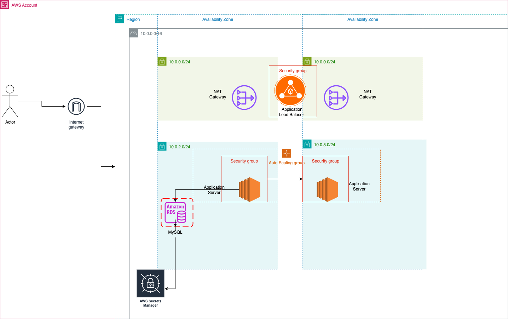

# Building a Highly Available and Scalable CRUD Web Application on AWS

## 📋 Overview
This project demonstrates a full-stack Node.js-based web application deployed on AWS with high availability and scalability using EC2, RDS, ALB, and Auto Scaling. All infrastructure is provisioned using AWS CDK (Infrastructure as Code).

---
## Main Architecture Diagram


## Methodology

### Phase 1: Creating a Basic Functional Web Application
- See `phase2.py` .
- Launched an EC2 instance to host the web application.
- Verified functionality and connectivity with a preconfigured RDS instance.
- Accessed the application via EC2 public IP.

---

### Phase 2: Creating and Configuring Amazon RDS
- See `phase3_1.py` .
- Created an RDS MySQL DB instance in the same VPC.
- Set up correct inbound rules to allow EC2 instance connection.
- Stored DB credentials securely and tested connection with the app.

---

### Phase 3: Auto Scaling Group and Application Load Balancer
- See `phase4_1.py` .
- Created a custom AMI from the Phase 2 EC2 instance.
- Used the AMI to launch an Auto Scaling Group.
- Configured an Application Load Balancer in public subnets to route traffic to ASG instances.
- Verified target group health and application accessibility via ALB DNS.


---

### Phase 4: Load Testing and Validation
- Used `loadtest` package to simulate high load.
- Observed scaling behavior and database connectivity under pressure.
- Diagnosed and resolved RDS connection saturation issues by rebooting and tuning.

> 📸 *[Insert Screenshot: Load testing results in terminal + Target Group status]*

---

## 🔨 Tech Stack
- AWS EC2
- AWS RDS
- AWS Application Load Balancer (ALB)
- AWS Auto Scaling
- AWS IAM
- AWS CDK (Python)
- Node.js + Express
- MySQL

---

## 📦 CDK Deployment
To deploy this stack via AWS CDK:
```bash
cd your-cdk-folder
cdk deploy
